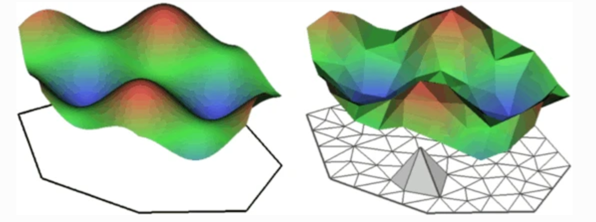
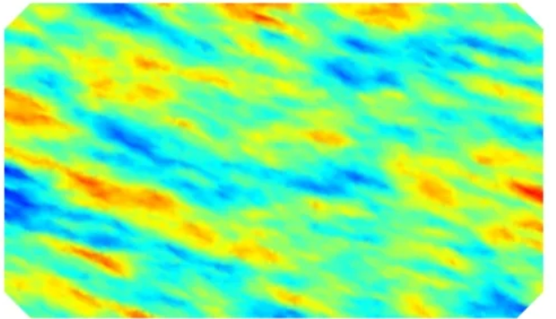
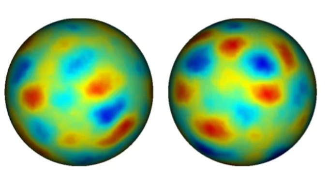

<!-- rmarkdown::render("1Intro/1Intro.Rmd","all",encoding="UTF-8") -->
<!-- rmarkdown::render("1Intro/1Intro.Rmd","html_document",encoding="UTF-8") -->
<!-- rmarkdown::render("1Intro/1Intro.Rmd","pdf_document",encoding="UTF-8") -->
<!-- rmarkdown::render("1Intro/1Intro.Rmd","beamer_presentation",encoding="UTF-8") -->


```{r setup, include=FALSE}
knitr::opts_knit$set(root.dir = "~/INLA_course/Part3/")

knitr::opts_chunk$set(echo = FALSE,  
                      message=FALSE, 
                      warning=FALSE, 
                      strip.white=TRUE, 
                      prompt=FALSE,
                      fig.align="center",
                       out.width = "60%")

library(knitr)    # For knitting document and include_graphics function
library(ggplot2)  # For plotting
library(png) 
library(tidyverse)
library(INLA)
library(patchwork)
library(viridis)
library(inlabru)
```

# What have we learned

## INLA in a nurshell

* many data sets these days are complex, resulting in complex
models, e.g. with complex dependence structures (spatial, temporal, etc..)

* usually Markov chain Monte Carlo (MCMC) methods have
been used to fit these models

   - (realistically) complex models result in very long running times
   
   - often impossible (or unrealistic) to fit
   
* INLA (Integrated nested Laplace approximation) is an alternative to MCMC

  - much, much **faster**
  
  - suitable for a specific (but very large!) class of models
    
## INLA in a nurshell
 
Three main ingredients in INLA

* Gaussian Markov random fields

* Latent Gaussian models

* Laplace approximations

which together (with a few other things) give a very nice tool for
Bayesian inference 

* quick

* accurate   

## Models amenable to INLA: **Latent Gaussian Models**

\small

$$
\begin{aligned}
\bf{y}|\bf{x},\bf{\theta} & \sim \prod_i\pi(y_i|x_i,\theta) & \text{Likelihood}\\
\bf{x}|\bf{\theta} & \sim \exp \left(-\frac{1}{2}\bf{x}^T\bf{Q}(\theta)\bf{x}^T \right)& \text{Latent field (GMRF)}\\
\bf{\theta} & \sim \pi(\theta) & \text{Hyperparameter}
\end{aligned}
$$

>-  Each data point depends on only one of the elements in the latent Gaussian field $\bf{x}$.

>-  The size of the hyperparameter vector $\theta$ is small (say $<15$)

>-  The latent field $\bf{x}$, can be large but it is endowed with some conditional independence (Markov) properties so that the precision matrix $Q(\theta)$ is sparse.

>- The linear predictor depends **linearly** on the unknown smooth function of covariates.

>- The inferential interest lies in the univariate posterior marginals $\pi(x_i|\bf{y})$ and $\pi(\theta_j|\bf{y})$  rather than in the joint posterior $\pi(\bf{x}, \theta|\bf{y})$ 

\normalsize


## 

INLA allows us to compute in a **fast** and **efficient** way an **accurate** approximation to the posterior marginals for the hyperparameters
$$
\tilde{\pi}(\theta_j|{\bf y})
$$
and for the latent field
$$
\tilde{\pi}(x_i|{\bf y})
$$
\pause 

All of this is implemented in the `INLA` library in `R`.\
\

Yesterday we saw how to implement simple models with `INLA`\
\

Today we are going to look at how to implement continuous spatial models.\
\


Such model are  **a lot** easier to implement in   `inlabru`!!!!

## `inlabru` in a nutshell

`inlabru` is a friendlier version of `R-INLA`

* it makes `INLA` more accessible to the user

* makes complex features and predictions (especially for spatial data) a lot easier

* is a softer-wrapper around `INLA`

* in some cases it allows to release some of the contraints of `R-INLA` (the linearity of the predictor) 

## `inlabru`

* Installation:
  
  - There is a CRAN version
```{r, echo = T, eval = FALSE}
install.packages("inlabru")
```
  
  - You can also install the development version of inlabru from GitHub (recommended)
```{r, echo = T, eval = FALSE}
# install.packages("remotes")
remotes::install_github("inlabru-org/inlabru",
          ref="devel")
```

* Documentation
  
  - Web site: \url{https://sites.google.com/inlabru.org/inlabru}
  - Github: \url{https://github.com/inlabru-org/inlabru}

# Spatial models

## Types of Spatial Data

We can distinguish three types of spatial data

* Discrete space

  - data on a spatial grid
  
* Continuous space:

    - geostatistical data

    - spatial point data


  
## Discrete Counts:   


**Data on a spatial grid** 


:::::: {.cols data-latex=""}

::: {.col data-latex="{0.45\textwidth}"}
* examples: number of
individuals in a region,
average rainfall in a province

* (originally geostatistical or
point data; gridded for
practical reasons)
:::

::: {.col data-latex="{0.05\textwidth}"}
\ 
<!-- an empty Div (with a white space), serving as
a column separator -->
:::

::: {.col data-latex="{0.55\textwidth}"}
```{r, out.width="100%"}
data(Germany)
spam::germany.plot(Germany$Y/Germany$E)
```

:::
::::::

**Observed response(s)**:

* Measurement over each grid cell (e.g. number of individuals in
cell; rainfall in province)

## Continuous Space: Geostatistics

:::::: {.cols data-latex=""}

::: {.col data-latex="{0.45\textwidth}"}
* phenomenon that is
continuous in space

* examples: nutrient levels in
soil, salinity in the sea

* measurements at a given set
of locations that are
determined by surveyor

:::

::: {.col data-latex="{0.05\textwidth}"}
\ 
<!-- an empty Div (with a white space), serving as
a column separator -->
:::

::: {.col data-latex="{0.55\textwidth}"}
```{r, out.width="80%"}
data = readRDS("Data/meuseData")
meuse  = data$meuse

meuse0 = sf::st_as_sf(meuse, coords = c("x", "y"), crs = "+init=epsg:28992")
ggplot() + geom_sf(data = meuse0, aes(color = log(zinc))) +
  ggtitle("log concentration of zinc next to the Meuse river")
```

:::
::::::

**Observed response(s)**:

* measurement(s) taken at given locations


## Continuous Space: Point Process

:::::: {.cols data-latex=""}

::: {.col data-latex="{0.45\textwidth}"}
* locations of objects
(individuals) in space
(typically 2D)

* examples: locations of trees
in a forest, groups of animals


:::

::: {.col data-latex="{0.05\textwidth}"}
\ 
<!-- an empty Div (with a white space), serving as
a column separator -->
:::

::: {.col data-latex="{0.55\textwidth}"}
```{r, out.width="80%"}
library("spatstat")

ggplot() + geom_point(data = data.frame(x = bei$x, y = bei$y), aes(x,y)) +
  coord_equal() + xlab("") + ylab("") + ggtitle("Location of 3605 trees in a tropical rain forest")
```

:::
::::::

**Observed response(s)**:

* $x,y$ coordinates of points (individuals/groups)

* maybe also properties of individuals/groups (“marks")

# Gaussian Random Field models

## Gaussian Random fields

**Definition**:A random function $u(x):R^d\rightarrow R$ is a Gaussian random field if for
any finite collection of locations, $(x_1,\dots, x_n)$, $x_i\in R^d$, the joint
distribution of ${\bf u} = (u(x_1),\dots, u(x_n))$ is ${\bf u} \sim N(0, \Sigma)$, and


$$
\begin{aligned}
E(u(x)) = 0, &\\ 
Cov(u(x), u(x')) = R(x, x'), && \Sigma_{ij} = R(x_i, x_j)
\end{aligned}
$$

for some expectation function $\mu(\cdot)$ and positive definite covariance
function $R(\cdot, \cdot)$. $\Sigma$ is the covariance matrix for the specific location collection.


## Example

```{r}
pl01 <- cbind(c(0, 1, 1, 0, 0) * 10, c(0, 0, 1, 1, 0) * 5)

mesh <- inla.mesh.2d(loc.domain = pl01, cutoff = 0.1, 
  max.edge = c(0.3, 1), offset = c(0.5, 1.5)) 

# SPDE model
spde <- inla.spde2.pcmatern(mesh,
                            prior.range=c(5,0.5), 
                            prior.sigma=c(1,0.1)) 

Q <- inla.spde2.precision(spde, theta =  c(2, 1))
sample <- as.vector(inla.qsample(1, Q))

loc = data.frame(x = runif(30,0,10),
                 y = runif(30,0,5))

# Plot parameters
par(mfrow = c(2, 1), mar = c(0, 0, 0, 0))
#Plot Field
proj <- inla.mesh.projector(mesh, xlim = 0:1 * 10, ylim = 0:1 * 5,
  dims = c(400, 400)) 
xy = expand.grid(proj$x, proj$y)
data.frame(x = xy[,1],
           y = xy[,2],
           z = as.vector(inla.mesh.project(proj, sample))) %>%
  ggplot() + geom_tile(aes(x,y,fill = z)) +
  geom_point(data = loc, aes(x,y)) +
  scale_fill_viridis()


```

## Gaussian Random field

GRF are a very popular model

+ Flexible and easy to use

+ Can be part of the latent Gaussian field in a LGM 

However:

+ **computationally inefficient** (the precision matrix is dense)

+ not flexible enough (complicated boundary, barrier,...)

# The SPDE approach

## The SPDE approach

+ Matern fields can be seen as solution to a PDE

+ Using finite element methods such solution can be represented using a GRMF
\
\
	
```{r, out.width = "70%"}
# All defaults

```


## Advantages of the SPDE approach

* Computationally fast

* Allows for flexible modeling

  - non-stationary models (anisotropy)
  
  - models on a sphere
  
  - non separable models
  
```{r, out.width="29%", out.height="20%",fig.show='hold',fig.align='center'}
# All defaults


```
  
All these models (and my more) can be fitted with `R-INLA` and `inlabru`  

## Learning about the SPDE approach

* F. Lindgren, H. Rue, and J. Lindström. *An explicit link between Gaussian fields and Gaussian Markov random fields: The SPDE approach (with discussion)*. In: Journal of the Royal Statistical Society, Series B 73.4 (2011), pp. 423–498.

* H. Bakka, H. Rue, G. A. Fuglstad, A. Riebler, D. Bolin, J. Illian, E. Krainski, D. Simpson, and F. Lindgren. *Spatial modelling with R-INLA: A review*. In: WIREs Computational Statistics
10:e1443.6 (2018). (Invited extended review). DOI: 10.1002/wics.1443.

* E. T. Krainski, V. Gómez-Rubio, H. Bakka, A. Lenzi, D. Castro-Camilio, D. Simpson, F. Lindgren, and H. Rue. *Advanced Spatial Modeling with Stochastic Partial Differential Equations using R and INLA*. Github version \url{www.r-inla.org/spde-book}. CRC press, Dec. 20


# Fitting spatial models 

##   Example: Meuse Data

Measures of zinc concentration.

```{r, out.height="50%"}
data = readRDS("Data/meuseData")
meuse  = data$meuse

boundary <- data$boundary


p1 = ggplot() + geom_point(data = meuse, aes(x,y,color = zinc))+
  scale_color_viridis()+
  coord_equal() + 
 theme(
  axis.text.x = element_blank(),
  axis.text.y = element_blank(),
  axis.ticks = element_blank()) +
  gg(boundary, color = "red") + 
  ggtitle("Zinc concentration")

p2 = ggplot() + geom_histogram(data = meuse, aes(zinc)) + 
 ylab("")

p3 = ggplot() + geom_point(data = meuse, aes(x,y,color = dist))+
  scale_color_viridis()+
  coord_equal() + 
    gg(boundary, color = "red") + 

 theme(
  axis.text.x = element_blank(),
  axis.text.y = element_blank(),
  axis.ticks = element_blank()) +
  ggtitle("Dist from river")

p1+p2 + p3
```


## The model

$$
\begin{aligned}
\log(Y(s)) &\sim \mathcal{N}(\eta(s),\sigma^2_y)\\
\eta(s)& = \alpha + \beta\ x(s) + u(s)\\
\end{aligned}
$$

where

* $Y(s)$ is the measure of zinc in location $s$

* $\alpha$  a common intercept

* $\beta$  a model parameter

* $x(s)$ distance from the river at location $s$

* $u(s)$ the Matern Gaussian field


## Step 1: Define the SPDE representation

* The mesh

* The SPDE model


## Define the SPDE representation: The mesh

1. Define the mesh
\small
```{r, echo = TRUE}
mesh <- inla.mesh.2d(loc.domain = cbind(meuse$x, meuse$y), 
                     max.edge = c(150, 500),
                     offset = c(100, 250) )
```

```{r, out.width="40%"}
ggplot() + inlabru::gg(mesh) + coord_equal() +
  ylab("") + xlab("") +
  geom_point(data = meuse, aes(x,y), size = 0.4)
```
\normalsize

## Define the SPDE representation: The mesh

\footnotesize
* All random field models need to be discretised for practical
calculations.

* The SPDE models were developed to provide a consistent model definition across a range of discretisations.

* We use finite element methods with local, piecewise linear basis
functions defined on a triangulation of a region of space
containing the domain of interest.

* Deviation from stationarity is generated near the boundary of
the region.

* The choice of region and choice of triangulation affects the
numerical accuracy.

\pause 

Two separate issues:

* Continuous space with bounded domain: Boundary effect

* Discretised model: Numerical accuracy

Sometimes the boundary effect may be desireable.

\normalsize

## Define the SPDE representation: The mesh

* Too fine meshes $\rightarrow$ heavy computation

* Too coarse mesh $\rightarrow$ not accurate enought

## Some guidelines


* Create triangulation meshes with `inla.mesh.2d()`

* Move undesired boundary effects away from the domain of
interest by extending to a smooth external boundary
(`inla.nonconvex.hull(loc, convex)`, `convex` $\geq$
correlation range)

* Use a coarser resolution in the extension to reduce
computational cost (`max.edge=c(inner, outer)`)

* Use a fine resolution (subject to available computational
resources) for the domain of interest (inner  correlation
range) and filter out small input point clusters (`0 < cutoff <
inner`)

* Coastlines and similar can be added to the domain specification
in `inla.mesh.2d()`

## Define the SPDE representation: The mesh
\small
```{r, echo = TRUE}
mesh1 = inla.mesh.2d(loc.domain = cbind(meuse$x, meuse$y), 
                     max.edge = 350,
                     offset = 10)

mesh2 = inla.mesh.2d(loc.domain = cbind(meuse$x, meuse$y), 
                     max.edge = c(150, 500),
                     cutoff = 100,
                     offset = c(100, 550) )

```

```{r}
p1 = ggplot() + inlabru::gg(mesh1) + coord_equal() +
  ylab("") + xlab("") +
  geom_point(data = meuse, aes(x,y), size = 0.4) +
  ggtitle("mesh1")
p2 = ggplot() + inlabru::gg(mesh2) + coord_equal() +
  ylab("") + xlab("") +
  geom_point(data = meuse, aes(x,y), size = 0.4)+
  ggtitle("mesh2")
p1+p2
```
\normalsize


## Define the SPDE representation: The SPDE model

\small
```{r, echo = T, eval = F}
meuse.spde <- inla.spde2.pcmatern(mesh = mesh,
                                  prior.sigma = c(1, 0.1),
                                  prior.range = c(1000, 0.5))
```

\normalsize

PC-priors for the range $\rho$ and the standard deviarion $\sigma$

* Define the prior for the range `prior.range  = (range0,Prange)` $\text{Prob}(\rho<\rho_0) = p_{\rho}$

* Define the prior for the range `prior.sigma  = (sigma0,Psigma)` $\text{Prob}(\sigma>\sigma_0) = p_{\sigma}$


## Run the model `inlabru`
\tiny
```{r, echo = T, eval = F, cache  = T}
# create a spatial object
coordinates(meuse) = c("x","y")
#  covariate values
dist_SPDE = SpatialPixelsDataFrame(data$dist_raster[,c(1,2)], 
                                  data = data.frame(dist = data$dist_raster[,3]))
# model components
cmp =  ~ Intercept(1) + dist(dist_SPDE, model = "linear") + 
  spde(coordinates, model = meuse.spde)
# define likelihood
lik = like(formula = Y ~ Intercept + dist +   spde,
           family = "gaussian",
           data  = meuse)
#fit the model
fit <- bru(cmp, lik)
# define prediction area
pix <- pixels(mesh, nx = 200, ny = 200, mask = boundary)
# generate predictions
pred = predict(fit, pix, ~ data.frame(
                                      spde = spde,
                                      logscale = Intercept + dist + spde,
                                      naturalscale = exp(Intercept + dist + spde)))
```


```{r, echo = FALSE, cache=TRUE}
data = readRDS("Data/meuseData")
meuse  = data$meuse

coordinates(meuse) = c("x","y")

meuse$Y = log(meuse$zinc)


mesh <- inla.mesh.2d(loc.domain = cbind(meuse$x, meuse$y), 
                     max.edge = c(150, 500),
                     offset = c(100, 250) )
meuse.spde <- inla.spde2.pcmatern(mesh = mesh,
                                  prior.sigma = c(1, 0.1),
                                  prior.range = c(1000, 0.5))

```


## Notes!

* The data are a spatial object!

* For prediction, the covariates are stored in a `SpatialPixelsDataFrame` and need to cover all the mesh nodes

```{r, cache = T}


dist_SPDE = SpatialPixelsDataFrame(data$dist_raster[,c(1,2)], 
                                  data = data.frame(dist =data$dist_raster[,3]))

cmp =  ~ Intercept(1) + dist(dist_SPDE, model = "linear") + 
  spde(coordinates, model = meuse.spde)

lik = like(formula = Y ~ Intercept + dist +   spde,
           family = "gaussian",
           data  = meuse)

fit <- bru(cmp, lik)

#Boundary
boundary <- data$boundary

pix <- pixels(mesh, nx = 200, ny = 200, mask = boundary)


pred = predict(fit, pix, ~ data.frame(
                                      spde = spde,
                                      logscale = Intercept + dist + spde,
                                      naturalscale = exp(Intercept + dist + spde)))

```

```{r}
p1 = ggplot() + gg(data = pred$spde, aes(fill = mean))  +
  scale_fill_viridis() + coord_equal() + xlab("") + ylab("")

p2 = ggplot() + gg(data = pred$spde, aes(fill = sd))  +
  scale_fill_viridis() +
  gg(meuse, size = 0.3) + coord_equal() + xlab("") + ylab("")

p3 = ggplot() + gg(data = pred$logscale, aes(fill = median))  +
  scale_fill_viridis() + coord_equal() + xlab("") + ylab("")

p4 = ggplot() + gg(data = pred$logscale, aes(fill = cv))  +
  scale_fill_viridis() +
  gg(meuse, size = 0.3) + coord_equal() + xlab("") + ylab("")

p5 = ggplot() + gg(data = pred$naturalscale, aes(fill = median))  +
  scale_fill_viridis() + coord_equal() + xlab("") + ylab("")

p6 = ggplot() + gg(data = pred$naturalscale, aes(fill = cv))  +
  scale_fill_viridis() +
  gg(meuse, size = 0.3) + coord_equal() + xlab("") + ylab("")

```

## Predictions: The SPDE field

```{r, out.width="80%"}
p1 + p2
```

## Predictions: The log concentrations

```{r, out.width="80%"}
p3 + p4
```

## Predictions: The  concentrations

```{r, out.width="80%"}
p5 + p6
```

## Same in plain `INLA` (1)

\tiny
```{r, echo = T, eval = F}

A.meuse <- inla.spde.make.A(mesh = mesh, loc = coordinates(meuse))
s.index <- inla.spde.make.index(name = "spatial.field",
  n.spde = meuse.spde$n.spde)

#Create data structure
meuse.stack <- inla.stack(data  = list(zinc = meuse$zinc),
  A = list(A.meuse, 1),
  effects = list(c(s.index, list(Intercept = 1)),
    list(dist = meuse$dist)),
  tag = "meuse.data")

data(meuse.grid)
coordinates(meuse.grid) = ~x+y
gridded(meuse.grid) = TRUE

#Create data structure for prediction
A.pred <- inla.spde.make.A(mesh = mesh, loc = coordinates(meuse.grid))
meuse.stack.pred <- inla.stack(data = list(zinc = NA),
  A = list(A.pred, 1),
  effects = list(c(s.index, list (Intercept = 1)),
    list(dist = meuse.grid$dist)),
  tag = "meuse.pred")

#Join stack
join.stack <- inla.stack(meuse.stack, meuse.stack.pred)
```

## Same in plain `INLA` (2)

\tiny
```{r, echo = T, eval = F}

#Fit model
form <- log(zinc) ~ -1 + Intercept + dist + f(spatial.field, model = spde)

m1 <- inla(form, data = inla.stack.data(join.stack, spde = meuse.spde),
  family = "gaussian",
  control.predictor = list(A = inla.stack.A(join.stack), compute = TRUE))
```
\normalsize

**Note**: We still have not compute predictions...and this is not too easy in plain `INLA`!!

## When is `inlabru` easier to use

* spatial modeling.

* point processes.

* multiple likelihoods

* when interested in spatial predictions

\pause

* `inlabru` is also useful if one has non-linearities in the predictor $\eta$

  - born for ecological models (for example transect sampling) but used also in other fields

\pause
 What cannot (at the moment ) be done with `inlabru`
 
* Survival models

# Space-time Modeling


## Modeling PM10 concentration in Piemonte (Italy)

```{r, out.width="90%"}
## Load the data
df = read.table("Data/Piemonte_data/Piemonte_data.dat")

df = df[df$time<=20,]
shape = readRDS("Data/Piemonte_data/Piemonte")

ggplot() + geom_point(data = df, aes(x,y,color = PM10)) +
  facet_wrap(time~.) + gg(shape) +
  scale_color_viridis() + xlab("")+ylab("") + 
  theme(
  axis.text.x = element_blank(),
  axis.text.y = element_blank(),
  axis.ticks = element_blank())
```

## Modeling PM10 concentration in Piemonte (Italy)

Example from the Blangiardo \& Cameletti book but simplified!
\tiny
```{r}
df[1:5,]
```
\normalsize

## The model

We model the log PM10 concentration:

$$
\begin{aligned}
y_{it}&\sim\mathcal{N}(\eta_it, \sigma^2_e)\\
\eta_{it}& = \alpha + \beta_1\text{dem}_i + \beta_2\text{temp}_{it} + \omega_{it}
\end{aligned}
$$

* $y_{it}$ is the log-concentration at location $i$ in time $t$

* $\alpha$ is an intercept

* $\beta_1$ and $\beta_2$ parameters of altitude and temperature

* $\omega_{it}$ is the space-time residual

## Space time residual model

A first order autoregressive process with spatially colored innovations

$$
\omega_{it}  = a \omega_{i(t-1)}+\xi_{it}
$$

* $|a|<1$ parameter of the AR1 process

* $\xi_{it}$ is a zero mean, temporally independent, Gaussian field with

$$
\text{Cov}(\xi_{it},\xi_{ju})  =
\begin{cases}
 0 ,& \text{ if } t\neq u \\
 \mathcal{C}(h),&  \text{ if } t= u
 \end{cases}
$$
  - $h$ distance between locations $i$ and $j$
  - $\mathcal{C}(h)$ is a Matern correlation function

## Building the model: mesh

```{r}
# create the mesh and hte spde model
mesh = inla.mesh.2d(loc = cbind(df$x, df$y),
                    offset = c(20,40),
                    max.edge = c(30,50))


ggplot() + gg(shape) + gg(mesh) +
  geom_point(data = df, aes(x,y)) + xlab("") + ylab("") +
  coord_equal()
```
## Building the model: Prior for the spde model
\small
```{r, echo = T}
spde = inla.spde2.pcmatern(mesh = mesh,
                           prior.range=c(100,0.5), 
                           prior.sigma=c(1,0.1)) 


```
\normalsize

* $\text{Prob}(\rho<100\text{ Km})  = 0.5$

* $\text{Prob}(\sigma>1)  = 0.1$

## Implement the model
\small
```{r, echo =T, cache = TRUE}
# make the data a spatial object
coordinates(df) = c("x","y")

# model component
cmp  = ~ Intercept(1) + 
  SPDE(coordinates, model = spde,
       group = time, control.group = list(model = "ar1")) +
  dem(dem, model = "linear") + 
  temp(temp, model = "linear")

# likelihood
lik = like(formula = logPM10 ~ Intercept + SPDE + dem + temp ,
           family = "gaussian",
           data = df)

# fit the model
fit = bru(cmp, lik,
          options = list(verbose = F,
                         bru_max_iter = 1,
                         inla.mode  = "experimental"))
```
## Model Parameters

Fixed effects:
\tiny
```{r}
fit$summary.fixed[,c(1,2,3,5),]
```
\normalsize

Hyperparameters of the random field:
\tiny
```{r}
fit$summary.hyperpar[,c(1,2,3,5),]
```


## Prediction at station locations

\small
```{r, echo = T, cache = T}
pred_at_station = predict(fit, df, 
                          ~exp(Intercept + SPDE + dem + temp ))
```
\normalsize

```{r, out.width="70%"}
sel = sample(1:24, 6) %>% sort()
as.data.frame(pred_at_station) %>%
  dplyr::filter(Station.ID %in% sel) %>% ggplot() + 
  geom_point(aes(time, PM10, group = Station.ID ), color = "red") +
  geom_line(aes(time, median, group = Station.ID)) +
  geom_ribbon(aes(time, 
                  ymin= q0.025, 
                  ymax = q0.975,
                  group = Station.ID), alpha = 0.5) +
  facet_wrap(.~Station.ID)
```

## Prediction is space

* To do this we need to have the covariates  over the space of interest.

* The should cover the whole mesh 

## Expanding the covariates: the `bru_fill_missing`
\tiny
```{r, echo = T, cache = T}
# read the covariate values
alt = read.table("Data/Piemonte_data/Altitude.dat")
## object with altitude, this does not cover the whole mesh!
dem = SpatialPixelsDataFrame(points = cbind(alt[,1],
                                            alt[,2]),
                             data = data.frame(dem = alt[,3]))
## create another object which  does cover the whole mesh
large_grid = expand_grid(x = seq(250, 580,4),
                         y = seq(4810, 5210,4))
# expand dem --------------------------------------------------------------
dem_large = SpatialPixelsDataFrame(points = large_grid,
                                   data = data.frame(dem = 
                                                       rep(NA,length(large_grid$x))))

# Use bru_fill_missing to fill the new object
dem_large$dem <- bru_fill_missing(data = dem,
                       where = dem_large,
                       values = dem_large$dem)
```
\normalsize
## Expanding the covariates: the `bru_fill_missing`

```{r, out.width="70%"}
p1 = ggplot() + gg(data = dem) +
  coord_equal() + gg(mesh) + xlab("") + ylab("") + scale_fill_viridis() +
  ggtitle("Original grid")
p2 = ggplot() + gg(data = dem_large) +
  coord_equal() + gg(mesh) + xlab("") + ylab("") + scale_fill_viridis() +
  ggtitle("Enlarged grid")
p1+p2+ plot_layout(guides = "collect")
```
Note: You can do this with your favourite method!
```{r, cache = TRUE}
# expand temp -------------------------------------------------------------
load("Data/Piemonte_data/Temp_GRID.Rdata")
temp = Mean_Temp[,,1:5]

mat = matrix(NA, dim(temp)[1]*dim(temp)[2], 5)
for(i in 1:5)
  mat[,i] =  as.vector(t(temp[,,i]))

temp = SpatialPixelsDataFrame(points = alt[,c(1,2)],
                             data = data.frame(temp = mat))

temp_large = SpatialPixelsDataFrame(points = cbind(large_grid$x,
                                                   large_grid$y),
                                   data = data.frame(temp = matrix(NA, 
                                                                   length(large_grid$x),5)))
                                                       
# # Use bru_fill_missing to fill the new objecttn
fill_names = names(temp)
for (layer in fill_names) {
  temp_large[[layer]] <- bru_fill_missing(temp, 
                                          temp_large, 
                                          values = temp_large[[layer]], 
                                          layer = layer)
}
```


# Prediction in space 

\tiny
```{r, echo = TRUE, cache = T}
# Create a space time grid 
pxl = pixels(mesh, nx = 200, ny = 200, mask = shape)
ips2 <- ipoints(domain = c(1:5), name = "time")
pxl_time <- cbind(cprod(pxl,ips2), data.frame(temp = 0))

pred_space = predict(fit, pxl_time, 
                      ~ Intercept + SPDE +
                       dem_eval(inlabru:::eval_SpatialDF(dem_large,
                                                         .data.)) +
                       temp_eval(inlabru:::eval_SpatialDF(temp_large,
                                                          .data.,
                                                          selector = "time")))
```
\normalsize

## Prediction in space 

```{r, out.width="90%"}

p1 = ggplot() +
  gg(pred_space, aes(fill = mean)) +
  facet_wrap(~time) +
  scale_fill_viridis() +
  xlab("") + ylab("") + 
  coord_equal() + ggtitle("Posterior mean")

p2 =  ggplot() +
  gg(pred_space, aes(fill = sd)) +
  facet_wrap(~time) +
  scale_fill_viridis() +
  xlab("") + ylab("") + 
  coord_equal()+ ggtitle("Posterior sd")

p1 + p2
```

## Samples form the fitted model

It is also possible to generate from the fitted model
\tiny
```{r, echo = T}
sim_space = generate(fit, pxl_time, 
                      ~ exp(Intercept + SPDE +
                       dem_eval(inlabru:::eval_SpatialDF(dem_large,
                                                         .data.)) +
                       temp_eval(inlabru:::eval_SpatialDF(temp_large,
                                                          .data.,
                                                          selector = "time"))),
                     n.samples = 2)
```

\normalsize

This can be usefull as the posterior means are always smoother than the "real" field

## Samples form the fitted model

```{r, out.width="90%"}
p1 = data.frame(x = coordinates(pxl_time)[,1],
           y = coordinates(pxl_time)[,2],
           time = pxl_time$time,
           conc = sim_space[,1]) %>%
  ggplot() + geom_tile(aes(x,y,fill = conc)) + 
  facet_wrap(.~time) + coord_equal() +
  xlab("") + ylab("") +
   scale_fill_viridis() + ggtitle("Sample 1 ")

p2 = data.frame(x = coordinates(pxl_time)[,1],
           y = coordinates(pxl_time)[,2],
           time = pxl_time$time,
           conc = sim_space[,2]) %>%
  ggplot() + geom_tile(aes(x,y,fill = conc)) + 
  facet_wrap(.~time) + coord_equal() +
    xlab("") + ylab("") +
  scale_fill_viridis() + ggtitle("Sample 1 ")

p1+p2
```

## Some concluding remarks

* `inlabru` is a wrapper around `INLA` so all the internal computations are identical!

* `inlabru` makes handling of spatial object a lot easier

* Transition from `sp` to `sf`/`terra` some changing can be expected 


##

\Large
Thank you for your attention!

\normalsize
If you have any doubts or questions, please write :
	\url{sara.martino@math.ntnu.no} 

	
```{r, out.width = "30%"}
# All defaults
include_graphics("graphics/smiley_small.jpg")
```

	
