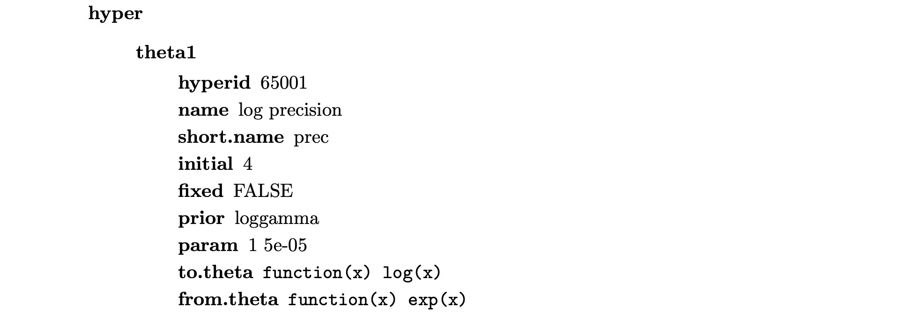

```{r setup, include=FALSE}
knitr::opts_knit$set(root.dir = "~/INLA_course/Practicals/")

knitr::opts_chunk$set(echo = TRUE,  
                      message=FALSE, 
                      warning=FALSE, 
                      strip.white=TRUE, 
                      prompt=FALSE,
                      fig.align="center",
                       out.width = "60%")

library(knitr)    # For knitting document and include_graphics function
```

```{r klippy, echo=FALSE, include=TRUE}
klippy::klippy(position = c('top', 'right'),
               color = 'darkred',
               tooltip_message = 'Click to copy', tooltip_success = 'Done')
```

---
\
\
\


Start by loading usefull libraries:
```{r}
library(INLA)
library(ggplot2)
library(patchwork)
library(spam)     
# load some libraries to generate nice map plots
library(fields)
library(colorspace)

```


<font size="5"> **Aim of this practical:** </font> In this first practical we are going to look at some simple models

1. A [Gaussian model](#Gaussian-link)  with simulated data
2. A [GLM model with random effects](#GLM-link) 
3. A [disease mapping model](#Disease-link) 

we are going to learn:

- How to fit a simple model with the `inla()` function
- How to explore the results
- How to change the prior distributions
- How to get predictions for missing data points

***

# Gaussian Example{#Gaussian-link}
In this practical we will use simulated Gaussian data to get familiar with the basic `R-INLA` functions. Moreover, we will see how to change the prior distributions both for the fixed effects $\beta_0$ and $\beta_1$ and for the hyperparameter $\tau = 1/\sigma^2$.

## Simulate the data

We simulate data from the model

$$
y_i\sim\mathcal{N}(\eta_i,0.1^2), \ i = 1,\dots,100
$$
with 
$$
\eta_i = \beta_0 + \beta_1 x_i
$$

where $\beta_0 = 2$,$\beta_1 = 0.5$ and the values of the covariate $x$ are generated from an Uniform(0,1) distribution. The simulated response and covariate data are then saved in a  `data.frame` object.

```{r}
set.seed(1234) #set the seed 
n = 100        # number of data points
sigma = 0.1    # sd of the observation error
beta.0= 2      # intercept
beta.1 = 0.5   # coefficient for covariate x
x = runif(n)   # simulate covariate values
eta = beta.0 + beta.1*x  #compute linear predictor
y = rnorm(n,eta,sigma)   #simulate observartions
my.data = data.frame(y=y,x=x) #create a data frame
ggplot(data = my.data) + geom_point(aes(x,y)) #plot the simulated data
```

## Model estimation 

We now use the `inla()` function to estimate the parameters in the latent field $x = (\beta_0,\beta_1)$ and the hyperparameter $\theta = \{1/\sigma^2\}$. 

```{r}
# define the formula
formula = y ~ x
# call the inla() function
output = inla(formula = formula,
              family = "gaussian",
              data  = my.data)
```

Notice that an intercept is always automatically included in the formula.

We can now loot at the results stored in the `output` object
```{r}
summary(output)
```

### Posterior marginals for the fixed effects

We can then look at the marginals for $\beta_0$ 

```{r}
# extract the marginal of interest
beta0 = output$marginals.fixed$`(Intercept)`
ggplot() + 
  geom_line(data = data.frame(beta0),aes(x,y)) + 
  geom_vline(xintercept = beta.0, lty  = "dashed")+
  ggtitle("Posterior marginal for beta_0")
```


<font size="3"> **Exercise  1:** </font> Plot the posterior marginal for $\beta_1$ and Use the function `inla.zmarginal()` to compute a summary of the posterior for the coefficient $\beta_1$. 


[Here](#Solution1) you find a solution.

```{r, eval = F}
beta1 = ???
p2 = ggplot() + 
  geom_line(data = data.frame(beta1), aes(x,y)) + 
  geom_vline(xintercept  = beta.1, lty  = "dashed")+
  ggtitle("Posterior marginal for beta_1")
```


### Posterior marginals for the hyperparameter


<font size="3"> **Exercise 2:** </font> Compute the posterior marginal for the sd of the observation error $\pi(\sigma^2|\bf{y})$
\
[Here](Solution2) you find the solution.

As default `inla()` returns the posterior marginal for the precision parameter $\tau = 1/\sigma^2$. If we are instead interested in the variance $\sigma^2$ we can compute it using
the `inla.tmarginal()` function:

```{r, echo  = FALSE, eval = T}
# extract the posterior for the precision parameter
tau = output$marginals.hyperpar$`Precision for the Gaussian observations`

#Use   `inla.tmarginal()` to compute the marginal for sigma^2
sigma2 = inla.tmarginal(fun = function(x) 1/sqrt(x), 
                        marginal = tau)

ggplot() + geom_line(data = data.frame(sigma2), aes(x,y)) +
  geom_vline(xintercept = sigma, lty = "dashed") +
  ggtitle("Posterior marginal for the variance parameter")

```

```{r, eval = F}
# extract the posterior for the precision parameter
tau = ??

#Use   `inla.tmarginal()` to compute the marginal for sigma^2
sigma2 = inla.tmarginal(fun = ??, 
                        marginal = tau)

ggplot() + geom_line(data = data.frame(sigma2), aes(x,y)) +
  geom_vline(xintercept = sigma, lty = "dashed") +
  ggtitle("Posterior marginal for the variance parameter")

```

## Changing the prior for the hyperparameter $\tau = 1/\sigma^2$

The default prior in `R-INLA` for the response precision $\tau = 1/\sigma^2$ is a noninformative logGamma prior defined on the logarithm of the precision (internal scale). 
As it can be seen from the following shot 
```{r, echo = FALSE, out.width = "70%"}
# All defaults

```

You can get the full documentation about how the Gaussian likelihood (or any other likelihood) is implemented in `INLA` as

```{r, eval = F}
inla.doc("gaussian")
```

The default prior distribution is then:
$$
\log(\tau)\sim\text{logGamma}(1,5e−05)
$$
This is equivalent to assuming a Gamma prior on the precision, ie 
$$
\tau\sim\text{Gamma}(1,5e−05)
$$

Since we are dealing with a parameter in the *likelihood* part of the model, it is possible to change its prior using the `control.family` option of the `inla()` function. For example if we want to specify a standard Normal(0,1) prior on the logarithm of the precision we will type:

```{r}
output3 = inla(formula, 
               family="gaussian", 
               data=my.data,
                    control.family=list(hyper=list(
                      prec=list(prior="gaussian",param=c(0,1)))))
```

<font size="3"> **Exercise 3:** </font> Change the prior for $\log(\tau)$ to a logGamma(1,0.01) [Solution](Solution3)
\
```{r, eval = FALSE}
output3 = inla(formula, 
               family="gaussian", 
               data=my.data,
                    control.family=???)
```

```{r, echo = F}
output3 = inla(formula, 
               family="gaussian", 
               data=my.data,
                    control.family=list(hyper=list(
                      prec=list(prior="gaussian",param=c(0,1)))))
```

# A GLM with random effects{#GLM-link}

We are now going to fit  GLM model with a random effect. 
Load the data `Seeds`
```{r}
data(Seeds)
```

This data concerns the proportion of seeds that germinated on each of 21 plates arranged according to a 2 by 2 factorial layout by seed and type of root extract. The data are shown below:
```{r, echo = F}
head(Seeds)
```


where $r_i$ and $n_i$ are the number of germinated and the total number of seeds on the $i$ th plate, $i =1,...,N$. The model is essentially a random effects logistic, allowing for over-dispersion. If $p_i$ is the probability of germination on the $i$ th plate, we assume
$$
\begin{aligned}
r_i &\sim \text{Binomial}(p_i, n_i )\\
\text{logit}(p_i ) &= a_0 + a_1 x _{1i} + a_2 x_{2i} + \epsilon_i
\end{aligned}
$$

 where $x_{1i}$ , $x_{2i}$ are the seed type and root extract of the $i$ th plate.
 
 
<font size="3"> **Exercise 4:** </font> Fit the above model in R-INLA and check the summary of the result. [Solution](#Solution4)
 
1. Remember that all random effects are defined through the `f()` function! 
2. Note that since the likelihood is binomial we also need to specify the number of trials. This is done in the `inla()` argument `N`. 
```{r,echo = F}
# write the formula
formula = r ~  x1 + x2 + f(plate, model= "iid")
# run inla
out = inla(formula,
           data = Seeds,
           N = n,
           family = "binomial")
```
 
```{r, eval = FALSE}
# write the formula
formula = r ~  ??
# run inla
out = inla(formula,
           data = Seeds,
           N = n,       
           family = "binomial")
# get the summary of the result
 ???
```

<font size="3"> **Exercise 5:** </font>  Plot the marginal posteriors for $a_0$ and $a_1$. Plot also the posterior means and a 95% CI for the random effect [Solution](#Solution5)


```{r, eval = F}
## extract the posterior margianls for 
## a0 and a1
a0 = ???
p1 = ggplot(data = data.frame(a0)) + geom_line(aes(x,y))
a1 = ???
p2 = ggplot(data = data.frame(a1)) + geom_line(aes(x,y))
p1+p2
```


The summaries for a random effect can be obtained by looking at `result$summary.random$NAME_OF_THE RANDOM_EFFECT`. So in our case:

```{r, eval = F}
## plot posterior mean and a 95% CI for the random effect
rand = out$summary.random$plate
ggplot(data = rand) + 
  geom_line(aes(x = ID, y = mean)) +
  geom_ribbon(aes(x = ID, 
                  ymin = `0.025quant`, 
                  ymax = `0.975quant`), alpha = 0.5)
```

# Disease Mapping{#Disease-link}

This time we are going to work with a disease mapping (DM) model. 

We consider data on the total Larynx cancer mortality in $544$ districts of Germany between 1986 and 1990.

This dataset is typical of many simple spatial examples and has the following properties:
 * Data $Y$ is given as the total number of counts in fixed areas across the spatial domain of interest
 
*  We know which areas neighbor each other

*  There is a covariate $x$ information regarding smoking consumption
that is also spatial

We will use the standard Poisson likelihood to model the counts 
$$
 y_i \mid \eta_i\sim Po\left(E_i \exp(\eta_i)\right),
$$

where $E_i$ is the ``population at risk'' in region $i$.  Using a different $E_i$ in each region can help account for spatial heterogeneity in the underlying population.

The goal of this exercise is to fit several models  without and with
covariate information. In a later exercise we will compare the
different model formulations.

The dataset is available in the `INLA` package and a plotting function
for the Germany map is available in the `spam` function. The data can be
loaded as follows:

```{r}
data(Germany)
str(Germany)    # see structure of data
```

and a map can be generated as:

```{r}
col <- diverge_hcl(8)      # blue - red
# use a function provided by spam to plot the map together with the mortality rates
germany.plot(Germany$Y/Germany$E, col=col, legend=TRUE)
```

### Fitting the model

We start by considering a classical disease mapping model
  containing an intercept $\mu$, a spatial structure effect $\bf{u}$ following the
  Besag model and an unstructured  effect $\bf{v}$. This model is also known as
  BYM model according to the authors who proposed it: Besag, York and
  Mollie.

  The log relative risk, $\bf{\eta} = (\eta_1, \dots, \eta_n)^T$, is thus decomposed
  into
$$
\bf{\eta} = \mu + \bf{u} + \bf{v}.
$$
Component ${\bf u} = (u_1, \ldots, u_n)^T$ is spatially structured
with smoothing parameter $\kappa_u$.  Component ${\bf v} = (v_1, \ldots, v_n)^T$ is unstructured
white-noise with precision parameter $\kappa_v$, i.e.
$\bf{v} \sim \mathcal{N}(0, \kappa_v^{-1}I)$.

The precision terms $\kappa_v$ and $\kappa_u$ are assigned the default
gamma prior distributions of INLA
$$
\begin{aligned}
  \kappa_u & \sim \textrm{Gamma}( \alpha_u, \beta_u ), \\
  \kappa_v & \sim \textrm{Gamma}( \alpha_v, \beta_v ).
\end{aligned}
$$

where $\textrm{Gamma}(\alpha, \beta)$ denotes the gamma density
with shape parameter $\alpha$ and rate parameter $\beta$. The default
values are $\alpha_u = \alpha_v = 1$ and $\beta_u = \beta_v = 0.00005$.

This model can be fit in INLA using:

```{r}
## load the neighbourhood file
g = system.file("demodata/germany.graph", package="INLA")
## just make a duplicated column
Germany = cbind(Germany,region.struct=Germany$region)

# standard BYM model (without covariates)
formula = Y ~ f(region.struct, model="besag", graph=g) +
               f(region, model="iid")

result  =  inla(formula, 
                family="poisson", 
                data=Germany, 
                E=E,
                control.compute = list(return.marginals.predictor	 = TRUE,
                                       config = TRUE),
                control.predictor=list(compute=TRUE))
```

We include the option `control.predictor=list(compute=TRUE)` and 
`control.compute = list(return.marginals.predictor	 = TRUE)` in
the `inla`-function to obtain also posterior marginals for the linear
predictor and the linear predictor transformed to the data scale.

We also include the option `control.compute = list(config = TRUE)` as we later want to sample from the fitted model.


<font size="3"> **Exercise 6:** </font> Fit the model and inspect the posterior marginals. 

<font size="3"> **Exercise 7:** </font> Use the function `germany.plot` to plot the median
    of $\exp(\bf{\eta})$. Generate a similar plot but showing
    $\exp(\bf{u})$. How do you interpret the plots? [Solution](#Solution7)


<font size="3"> **Exercise 8:** </font> 
We want to evaluate the proportion of the variance explained by the spatially structured component $\bf{u}$:
$$
\text{frac}_{\text{spatial}} = \frac{\sigma^2_u}{\sigma^2_v+\sigma^2_u}= \frac{\tau_v}{\tau_v+\tau_u}
$$
where $\tau_v = 1/\sigma^2_v$ and $\tau_u = 1/\sigma^2_u$.

To do so we can use the `inla.hyperpar.sample()` function which generates samples from $\tilde{\pi}(\theta|y)$:
```{r, echo = TRUE}
hyper = inla.hyperpar.sample(n = 1000, result)
colnames(hyper)
```

Write a function that computes the quantity of interest $\text{frac}_{\text{spatial}}$ and comments on the results.
[Solution](#Solution8)


<font size="3"> **Exercise 9 :** </font>  Next we would like to include the covariate $\mathbf{x}$ into the
  model for larynx cancer as a linear effect. Extend the INLA code provided above and
  inspect the summary statistics to see how large the effect of
  smoking is.  [Solution](#Solution9)
  
<font size="3"> **Exercise 10:** </font> Instead of assuming a linear effect, include the covariate as a non-linear
  effect using ar random walk of second order (`rw2`). You can use
  the  default prior parameters of INLA for the gamma prior of the
  corresponding precision parameter. Plot  the
posterior median within $95\%$ credible intervals of $\bf{x}$. Based
  on this plot, what do you think is a linear or non-linear effect better suited?[Solution](#Solution10)

## Prediction in an unobserved area


We now pretend that the observed data are missing in one of the regions  and want to predict the expected count for that region.
```{r}
ind = 35
Germany_pred = Germany
Germany_pred$Y[ind] = NA
```


<font size="3"> **Exercise 11:** </font> Fit the model again using the new dataset. Use the version where smoking is included as a linear covariate.
```{r, echo = F, eval = T}
## 2. Add smoking as a linear covariate to the larynx cancer data

formulaLC1 = Y ~ f(region.struct, model="besag", graph=g) +
  f(region, model="iid") + x

resultLC1  =  inla(formulaLC1, family="poisson", data=Germany_pred, 
                   E=E,
                  control.compute = list(config = TRUE, 
                           return.marginals.predictor=TRUE), 
                  control.predictor=list(compute=TRUE, 
                                       link = 1))
```

```{r, echo = T, eval = F}
## 2. Add smoking as a linear covariate to the larynx cancer data

formulaLC1 = Y ~ ??

resultLC1  =  inla(formulaLC1, family="poisson", data=Germany_pred, 
                   E=E,
                  control.compute = list(config = TRUE, 
                           return.marginals.predictor=TRUE), 
                  control.predictor=list(compute=TRUE, 
                                       link = 1))
```
Notice that we have added here the options:

* `control.compute = list(config = TRUE,return.marginals.predictor=TRUE)`: to tell `inla()` to return the marginals for the fitted value $\exp(\eta)$ and to have the possibility to sample from the fitted model

* `control.predictor=list(compute=TRUE,link = 1)`: to tell `inla()` to compute the posterior marginals for the linear predictor $\eta$ and to inform it about this link function to use (see `?control.predictor`)

<font size="3"> **Exercise 12:** </font> Plot the posterior marginal for $\exp(\eta)$ for region `r ind` [Solution](#Solution12)


<font size="3"> **Exercise 13:** We want to generate predictions for the counts in region `r ind`. To do this we first need to find the posterior for the mean of the Poisson distribution in the region of interest $\lambda = E\exp(\eta)$. We can do it using samples:
```{r}
nsamples = 1000
lambda_dens = resultLC1$marginals.fitted.values[[ind]]
samples_lambda = inla.rmarginal(1000, lambda_dens)*Germany$E[ind]
hist(samples_lambda, freq = F)
```

This is not the prediction density! We have obtained an estimate for $\pi(\lambda|y_1,\dots,y_n)$ but what we want is $\pi(y_{new}|y_1,\dots,y_n)$. Can you compute such prediction density? How does it look when compared to the histogram above? [Solution](#Solution13)


# Solutions

## Exercise 1{#Solution1}
```{r, echo = T, eval = FALSE}
# to extract the postrior marginal for beta_1
beta1 = output$marginals.fixed$x
# to compute posterior summaries
inla.zmarginal(beta1)
```

## Exercise 2{#Solution2}
```{r, eval = T}
# extract the posterior for the precision parameter
tau = output$marginals.hyperpar$`Precision for the Gaussian observations`

#Use   `inla.tmarginal()` to compute the marginal for sigma^2
sigma2 = inla.tmarginal(fun = function(x) 1/sqrt(x), 
                        marginal = tau)

ggplot() + geom_line(data = data.frame(sigma2), aes(x,y)) +
  geom_vline(xintercept = sigma, lty = "dashed") +
  ggtitle("Posterior marginal for the variance parameter")

```

## Exercise 3{#Solution3}

```{r, echo = T, eval = F}
output3 = inla(formula, 
               family="gaussian", 
               data=my.data,
                    control.family=list(hyper=list(
                      prec=list(prior="loggamma",param=c(0,0.01)))))
```

## Exercise 4{#Solution4}

```{r, echo = T, eval = F}
# write the formula
formula = r ~  x1 + x2 + f(plate, model= "iid")
# run inla
out = inla(formula,
           data = Seeds,
           N = n,
           family = "binomial")
# get the summary of the result
summary(out)
```

## Exercise 5{#Solution5}
```{r, echo = T, eval  = F}
## extract the posterior margianls for 
## a0 and a1
a0 = out$marginals.fixed$`(Intercept)`
p1 = ggplot(data = data.frame(a0)) + geom_line(aes(x,y))
a1 = out$marginals.fixed$x1
p2 = ggplot(data = data.frame(a1)) + geom_line(aes(x,y))
p1+p2

## plot posterior mean and a 95% CI for the random effect
rand = out$summary.random$plate
ggplot(data = rand) + 
  geom_line(aes(x = ID, y = mean)) +
  geom_ribbon(aes(x = ID, 
                  ymin = `0.025quant`, 
                  ymax = `0.975quant`), alpha = 0.5)
```

## Exercise 7{#Solution7}
```{r, echo = T, eval  = F}
par(mfrow = c(1,2))
germany.plot(result$summary.fitted.values$"0.5quant", col=col, legend=TRUE)
germany.plot(exp(result$summary.random$region.struct$"0.5quant"), col=col, legend=TRUE)

```

The plots are very similar, meaning that the unstructured part of the model does not contribute much to the fitted value.


## Exercise 8{#Solution8}
```{r, echo = T, eval  = F}
frac_spatial <- hyper[,2] / (hyper[,1]+hyper[,2])
hist(frac_spatial, n = 50, freq = F)
mean(frac_spatial)
```

The posterior mean of $\text{frac}_{\text{spatial}}$ is around 0.99 which means that most of the variability is explained from the spatial effect. This confirms the impression we had from the previous exercise.

## Exercise 9{#Solution9}

```{r, echo = T, eval = F}
## 2. Add smoking as a linear covariate to the larynx cancer data

formulaLC = Y ~ f(region.struct, model="besag", graph=g) +
  f(region, model="iid") + x

resultLC  =  inla(formulaLC, family="poisson", data=Germany, E=E,
                control.predictor=list(compute=TRUE))

# check summary statistics => slight positive effect of smoking
summary(resultLC)
```

## Exercise 10{#Solution10}

```{r, echo = T, eval = T}
## 3. Add smoking as a non-linear effect, here a RW2

formulaRW2 = Y ~ f(region.struct, model="besag", graph=g) +
  f(region, model="iid") + f(x, model="rw2")

resultRW2  =  inla(formulaRW2, family="poisson", data=Germany, E=E,
                  control.predictor=list(compute=TRUE))

# plot median within 95% CI for smoking


ggplot(data = resultRW2$summary.random$x ) + geom_line(aes(ID, mean)) +
  geom_ribbon(aes(ID, ymin = `0.025quant`, ymax = `0.975quant`), alpha = 0.5)
```
Based on this plot we might think actually that a linear effects is plausible
However, since the 95CI is a point-wise and not simultaneous, we can not say
this for sure. We have to look at model choice criteria.

## Exercise 12{#Solution12}
```{r, echo = T, eval = F}
plot(resultLC1$marginals.fitted.values[[35]])
```

## Exercise 13{#Solution13}
```{r, echo = T, eval = F}

predDist = rpois(1000, lambda = samples_lambda)

ggplot() + geom_density(data = data.frame(predDist = predDist), aes(predDist))+ geom_density(data = data.frame(samples_lambda = samples_lambda), aes(samples_lambda), color = "red") +
  geom_vline(xintercept = Germany$Y[ind])
```


